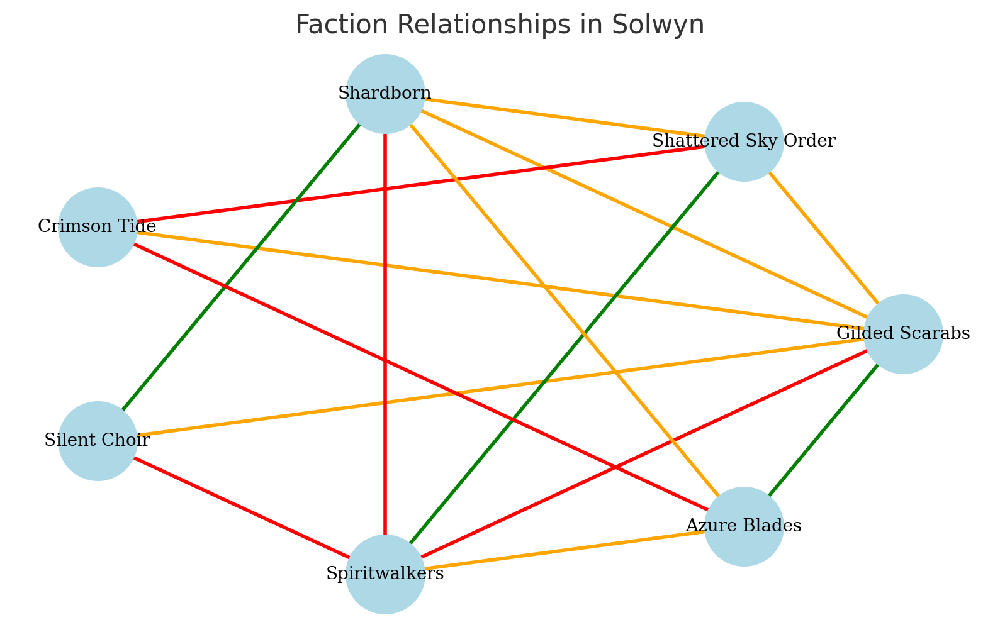

# The World of Solwyn

---

# Player Introduction: Welcome to Solwyn

> Welcome to **Solwyn** — a world shaped by ancient magic, blazing light, and shadows that have never fully faded.
>
> Long ago, a living sun graced the skies, its shards now scattered across the land, pulsing with wild, forgotten power.
> Across Solwyn’s great spine, the **Cloudspire Peaks** stab into storm-wracked skies, their monasteries clinging to cliffs and whispering secrets to the lightning.
> To the south, the **Verdant Expanse** pulses with untamed magic, where trees walk, rivers shift their course, and spirits weave the dreams of those who dare enter.
> In the north, the **Ember Wastes** hide the tombs of once-mighty Ashen Kings, where winds scrape bone and sand from half-buried cities.
> On the glittering **Sapphire Coast**, fortunes rise and fall with the tides, as masked merchant princes and pirate captains barter gold for blood.
> Far to the east, the **Moonlit Isles** drift beneath veils of mist, where rain flows upward and lost civilizations sing through the fog.
>
> **Here, the world itself is alive.** Storms are not merely storms—they are thinking tempests. Jungles do not just grow—they awaken. The sea does not just churn—it remembers.
> In Solwyn, the brave chase after relics of the First Sun, forge uneasy alliances with spirit-bound powers, and carve their legends into a land that remembers every triumph and every betrayal.
>
> Whether you are a relic hunter from the shifting dunes, a storm-touched monk from the peaks, a freebooter of the misty isles, or something wholly unexpected, know this:
>
> **Solwyn rewards the daring. It devours the foolish. And it never, ever forgets.**

---

# Core Concepts

**World Name:** Solwyn

**Flavor Statement:**
> "Solwyn is a land of blazing light and deep shadows, where bold adventurers chase legends across seas, deserts, and soaring mountains."

**Overall Feel:**
- Proud and Ancient
- Mystical and Alive
- Diverse and Teeming

**Continent Layout:**
- Vertical (North-South) layout
- North: Ember Wastes (deserts)
- Center: Cloudspire Peaks (mountains)
- South: Verdant Expanse (magical jungle)
- East: Sapphire Coast (trade cities)
- Southeast Offshore: Moonlit Isles (mystical islands)

---

# Major Regions

## Ember Wastes
A sun-scorched expanse of endless dunes, ancient tombs, and crumbling ruins. Winds whisper through abandoned cities, carrying secrets of the Ashen Kings.

## Cloudspire Peaks
Jagged mountains that slice through the sky, often wrapped in stormclouds. Monasteries cling to cliffs, and ancient magics crackle with the Breathless Tempests.

## Sapphire Coast
A glittering, tropical shoreline bursting with trade cities, pirate coves, and merchant intrigue. Fortunes are made and lost with the tides.

## Verdant Expanse
An ancient, sprawling jungle teeming with wild magic, sentient flora, and spirits. The deeper one goes, the less the rules of reality seem to apply.

## Moonlit Isles
A scattered chain of mystical islands shrouded in mist, ancient ruins, and supernatural phenomena. A haven for pirates, mystics, and madmen. Among the most famous are the **Weeping Isles**, a subcluster where rain flows upward and the ruins of a sunken civilization glow beneath the waters.

---

# Major Mysteries and Forces

## Shards of the First Sun
Long ago, Solwyn was blessed by a living sun, which shattered during a forgotten cataclysm. Its shards remain hidden across the world, radiating unstable magical power.

## Breathless Tempests
Silent, deadly storms that rage over the Cloudspire Peaks and sometimes drift toward the Moonlit Isles, mingling with natural mists to create supernatural storm-phantoms.

## Verdant Pulse
A living force deep within the Verdant Expanse. It shapes the land itself, warping rivers, moving forests, and empowering strange lifeforms.

## Ashen Kings
Undead rulers of a fallen desert empire. Their tombs lie buried beneath the Ember Wastes, and their cursed legacies stir restless spirits.

## Weeping Isles
A mist-shrouded cluster of islands marked by the ruins of a sunken civilization, swallowed by the sea in ancient times. Unlike the desert empires, the Weeping Isles fell through their own forgotten calamity.

---

# Major Cities and Landmarks

## Ember Wastes

### Vaer Rhadin
- **Atmosphere:** Hot, dusty, filled with relic hunters and tomb raiders.
- **Leadership:** The Ruby Council (merchant-kings and sorcerers)
- **Factions:** Gilded Scarabs, Ashen Guard, Silent Choir
- **Adventure Hooks:** Cursed tomb leaking spirits; black market relic smuggling; council political intrigue.

### Sunken Palace
- Half-buried tomb of the Last Ashen King, swallowed by the sands after the fall of the Ashen Empire. Linked to the Shattering of the First Sun, though its mystery remains distinct from the drowned cities of the Moonlit Isles.

## Cloudspire Peaks

### High Aerie
- **Atmosphere:** Quiet, mystical, crackling with storm energy.
- **Leadership:** Grand Scriptor and divided monastic orders.
- **Factions:** Order of the Shattered Sky, Brotherhood of the Silent Climb, Aerie Smugglers
- **Adventure Hooks:** Vanishing monks; ghost ships in tempests; monastery rivalries.

### Stormroots
- Ancient petrified forest animated during Breathless Tempests. Lightning-struck trees awaken as lumbering elemental guardians or whisper haunting songs across the cliffs.

## Sapphire Coast

### Carthisport
- **Atmosphere:** Bustling, glamorous, dangerous.
- **Leadership:** The Concord of Masks (masked merchant princes)
- **Factions:** Azure Blades, Silver Ledger, Court of Coin and Shadow
- **Adventure Hooks:** Brewing trade wars; missing cargo; cursed relics disrupting city life.

### Spindrift Towers
- Ancient sea towers that sing during storms; few return after exploring them.

## Verdant Expanse

### Thrynn's Hollow
- **Atmosphere:** Dreamlike, vibrant, steeped in spirit magic.
- **Leadership:** The Circle of Thrynn (shamanic council)
- **Factions:** Spiritwalkers, Verdant Pact, Vinebound
- **Adventure Hooks:** Jungle wrath; forbidden ruins; spiritual civil strife.

### Heartroot Basin
- Crater where the Verdant Pulse lies beneath shimmering, shifting flora.

## Moonlit Isles

### Port Varuun
- **Atmosphere:** Rowdy, chaotic, fiercely independent.
- **Leadership:** Free Captains' Council
- **Factions:** Crimson Tide, Mistborn Navigators, Tidecallers
- **Adventure Hooks:** Lost Sunken City maps; ghost ship sightings; pirate council upheaval.

### Weeping Isles
- Mist-rising islands marking a sunken civilization; haunted by sorrowful spirits.

---

# Minor Settlements

## Ember Wastes
- **Sandrest:** Neutral fortified caravanserai.
- **Glassmere:** Town built around natural glass formations.
- **Mirage's End:** Ghost village swallowed by dunes.

## Cloudspire Peaks
- **Driftstone:** Base village for monks and traders.
- **Silver Pass:** Mountain waystation carved into cliffs.
- **Frostwall Monastery:** Ruined monastery high in the peaks.

## Sapphire Coast
- **Selvi's Landing:** Fishing village turned trade port.
- **Brightwater:** Shipyard and coral market town.
- **Saltspire Keep:** Pirate-controlled ruined fort.

## Verdant Expanse
- **Riverfen:** Swampy river town, home to spirit-speaking "fenfolk."
- **Greenthorn Outpost:** Last ranger station before the wild jungle.
- **Bloomshade:** Hidden village illuminated by bioluminescent plants.

## Moonlit Isles
- **Driftport:** Floating, nomadic port community.
- **Mistcairn:** Mist-covered town on a Weeping Isle.
- **Redwake Cove:** Pirate den hidden behind cliffs.

---

# Main Travel Routes

| Route | Type | Notes |
|:-----|:-----|:------|
| Shardroad | Desert caravan trail | Sandstorms, relic hunters |
| Mirage Crossings | Nomad desert paths | Requires expert guides |
| Silver Spire Road | Mountain trail | Exposed cliffs, storms |
| Frost Passage | High alpine crossing | Deadly winters |
| Gilded Road | Coastal trade route | Merchant and pirate traffic |
| Coastal Wave | Eastern shipping lane | Pirate dangers |
| Greenflow | River route through jungle | Magical hazards deeper south |
| Spirit Paths | Jungle spirit-trails | Must gain spirit favor |
| Pirate's Wake | Island-hopping pirate lanes | Ghost ships, monsters |
| Mistrun | Mist-shrouded sea route | Supernatural distortions |

---

# Special Terrain Features

- **Thornwild:** Vicious jungle edge where nature twists intruders.
- **Shifting Dunes:** Mirage-haunted sands of the Ember Wastes.
- **Stormroots:** Lightning-woken petrified forests.
- **Gilded Markets:** Opulent trade hubs blending piracy and wealth.
- **Bloomshade Gardens:** Bioluminescent, hidden jungle fields.

---

# Major Factions of Solwyn

## World-Spanning Factions

- **Gilded Scarabs:** Artifact raiders and black-market relic dealers.
- **Shattered Sky Order:** Fractured monks studying and mastering storm magic.
- **Shardborn:** Mortals corrupted or evolved by the Shards of the First Sun.

## Regional Factions

- **Crimson Tide:** Ruthless pirate fleet seeking to rule the Moonlit Isles.
- **Silent Choir:** Cult worshiping the Ashen Kings, seeking their return.
- **Spiritwalkers:** Mystics and guardians of Solwyn's natural balance.
- **Azure Blades:** Mercenary navy and privateers for hire.

---

# Faction Relationships

## Overview

- **Gilded Scarabs**: Allies with Azure Blades; Enemies with Spiritwalkers; Tensions with Shardborn and Silent Choir.
- **Shattered Sky Order**: Allies with Spiritwalkers; Enemies with Crimson Tide; Tensions with Gilded Scarabs.
- **Shardborn**: Allies with Silent Choir; Enemies with Spiritwalkers; Tensions with Gilded Scarabs and Shattered Sky Order.
- **Crimson Tide**: Enemies with Azure Blades and Shattered Sky Order; Tensions with Gilded Scarabs.
- **Silent Choir**: Allies with Shardborn; Enemies with Spiritwalkers; Tensions with Gilded Scarabs.
- **Spiritwalkers**: Allies with Shattered Sky Order; Enemies with Gilded Scarabs, Silent Choir, and Shardborn; Tensions with Azure Blades.
- **Azure Blades**: Allies with Gilded Scarabs; Enemies with Crimson Tide; Tensions with Spiritwalkers and Shardborn.

## Visual Representation

- **Green lines** = Allies
- **Red lines** = Enemies
- **Orange lines** = Tensions

---

# Flashpoints

## 1. The Auction of Blades
- **What’s Happening:** The Gilded Scarabs are auctioning a relic said to control Breathless Tempests.
- **Factions Involved:** Gilded Scarabs, Azure Blades, Shattered Sky Order, Spiritwalkers
- **Player Hooks:** Protect or steal the relic, navigate secret bids, survive pirate attacks.

## 2. The Crimson Siege
- **What’s Happening:** The Crimson Tide besieges Port Varuun, aiming to overthrow the Free Captains' Council.
- **Factions Involved:** Crimson Tide, Azure Blades, Port Varuun locals
- **Player Hooks:** Smuggle supplies, rescue hostages, choose a side.

## 3. The Awakening Choir
- **What’s Happening:** The Silent Choir completes a ritual to awaken an Ashen King beneath Vaer Rhadin.
- **Factions Involved:** Silent Choir, Shardborn, Spiritwalkers, Ruby Council
- **Player Hooks:** Stop or aid the awakening, protect or sabotage the Ruby Council, battle an undead king.

## 4. Storms Over High Aerie
- **What’s Happening:** A rogue sect of the Shattered Sky Order unleashes an uncontrollable Breathless Tempest.
- **Factions Involved:** Shattered Sky Order (loyalists and radicals), Spiritwalkers
- **Player Hooks:** Climb into a raging storm, destroy or learn from radical monks, recover ancient relics.

## 5. The Jungle Stirs
- **What’s Happening:** A moving jungle fortress awakens due to the Verdant Pulse's flare.
- **Factions Involved:** Spiritwalkers, Verdant Pact, Gilded Scarabs
- **Player Hooks:** Chase and map the fortress, unlock ancient jungle secrets, survive awakened spirits.

---

# 🏜️ Ember Wastes - Cultural Profile

**General Attitude:**
Life in the Ember Wastes demands cunning *and* reverence.
Survivors are expected to be quick-witted and opportunistic, seizing advantages when they can — but also to show deep respect for the ancient powers buried beneath the sands. Words are chosen carefully, and silent gestures or symbols often carry more weight than loud declarations.

**Style and Dress:**
People wear flowing robes and turbans, designed to shield them from the brutal desert sun and sandstorms. Embroidered patterns show house allegiance, clan ancestry, or personal achievements. Practicality blends with a surprising vibrancy of color among wealthier classes.

**Architecture:**
Fortified sandstone cities rise from the dunes, with thick walls to keep out raiders and sandstorms. Much of life happens underground, in cool, labyrinthine chambers and marketplaces hidden beneath the surface. Water cisterns and shaded wells are treasured community centers.

**Festivals and Customs:**
The Trial of Suns is the greatest event in the desert — a grueling endurance race across the unforgiving dunes, held once a generation. Competitors are tested by the desert itself; some vanish into myth, others return legends. Winning the Trial brings a name sung for centuries.

**Relationship to Magic:**
Magic is respected but ritualized. Only sanctioned magic — such as water-calling, sand-warding, or spirit-blessing — is seen as acceptable. Anything resembling necromancy, uncontrolled elemental forces, or relic-magic from the Ashen Kings is deeply feared and could result in exile… or worse.

---

# 🏔️ Cloudspire Peaks - Cultural Profile

**General Attitude:**
The people of the Cloudspire Peaks are stoic and disciplined, tempered by a spiritual detachment. Life among the towering cliffs demands strict self-control, duty, and respect for the mysteries of the storm. Many spend long hours in silent contemplation, believing the Breathless Tempests to be more ancient and wise than any mortal sage.

**Style and Dress:**
Thick, heavy cloaks and braided cords are worn by all — the cloaks insulate against the cold and sudden storms, while the cords mark life's achievements: a first storm climbed, a battle survived, a vision received. Braiding rituals are deeply personal and often sacred.

**Architecture:**
Massive stone keeps and monasteries are carved directly into the cliffs, reinforced to endure even the fiercest winds. Bell towers rise from many settlements, their deep tones used to signal through storms, celebrate victories, or mourn losses.

**Festivals and Customs:**
The Calling of Storms is the most sacred event of the year. Communities gather at cliff-top shrines where storm-mages and monks attempt to commune with the Breathless Tempests. Visions received during the Calling shape prophecies, guide leaders, and sometimes ignite ancient fears.

**Relationship to Magic:**
Magic is common and practical among the Cloudspire folk. Children are taught basic wind-shaping, lightning warding, and storm-sensing magic from a young age. Those with stronger talents are encouraged to join the monasteries to refine their gifts — but all are expected to respect the unpredictable nature of the storms.

---

# 🌊 Sapphire Coast - Cultural Profile

**General Attitude:**
The people of the Sapphire Coast are outgoing, ambitious, and love their pleasures. Life here is a contest of charm, wit, and daring — fortune smiles on the bold, and those who hesitate are left behind. Beneath the open laughter and flowing wine, however, lies a ruthless streak: success is fleeting, and betrayal is a tide everyone must someday swim against.

**Style and Dress:**
Tailored longcoats, wide belts, and leather boots are common among sailors and merchants alike — practical enough for sea life, but always cut to impress. Light linens are worn underneath to beat the tropical heat, and tattoos of sea creatures, ships, or family symbols often trace the skin of those who've earned their scars.

**Architecture:**
Grand harbor cities bustle with stacked stone-and-wood buildings, busy piers, and fortified sea walls — but nestled within and beneath them lie labyrinthine slum-ports, hidden docks, and smoky taverns where fortunes are made or lost by midnight. Wealth and ruin exist side by side, often separated by little more than a bridge or a bribe.

**Festivals and Customs:**
On the nights of the Dueler's Moon — when the twin moons rise together — grudges, debts, and slights are settled in public duels cheered by roaring crowds. At the end of each year, during the Singing Ships festival, ships are adorned with lights and bright sails, and crews serenade the sea itself, hoping for luck and favor in the coming voyages.

**Relationship to Magic:**
Magic is powerful but secretive on the Sapphire Coast. Legal guilds regulate certain magical services, but much magic circulates through black markets — smuggled charms, illicit weather-warping, hidden enchantments. Everyone knows a \"friend of a friend\" who can get what you need... for a price.

---

# 🌿 Verdant Expanse - Cultural Profile

**General Attitude:**
The people of the Verdant Expanse live communally, guided by intuition and fierce emotion. Life is deeply tied to the spirits of the land — protecting kin and sacred places is an instinct as natural as breathing. Emotions are not hidden but embraced, and loyalty to tribe and spirit is the highest virtue.

**Style and Dress:**
Light leathers and bark armor are common, crafted from jungle creatures and enchanted plants. These garments are flexible and strong, allowing for quick movement through the dense wilds. Many adorn their outfits with small fetishes — feathers, carved stones, and bones of revered beasts — honoring their spirit allies.

**Architecture:**
Verdant settlements blend seamlessly into the living jungle. Tree cities rise high into the ancient canopy, connected by swinging vine bridges. Root-fortresses guard riverbanks with walls of enchanted bark, while hidden spirit sanctuaries dot the jungle, shielded by living magic. Outsiders rarely find these places unless the jungle itself wills it.

**Festivals and Customs:**
The Great Hunt is a sacred celebration — not merely of conquest, but of balance. Hunters honor both predator and prey, ensuring the spirit web remains strong. At the River’s Song, entire tribes gather by starlit rivers, releasing floating lights and singing songs to honor the water spirits who bless their travels and harvests.

**Relationship to Magic:**
Magic is everywhere and as natural as the air. Spirits infuse every rock, stream, and leaf, and even a simple path through the jungle may shift at a spirit’s whim. Every child learns basic spirit respect rituals, and many adults form personal pacts with minor spirits throughout their lives.

---

# 🌙 Moonlit Isles - Cultural Profile

**General Attitude:**
The people of the Moonlit Isles are fiercely free-spirited and rebellious. Laws mean little here — respect is earned through strength, wit, and cunning. Life is harsh and the tides are treacherous, so the islanders live boldly, seize opportunity quickly, and trust few outside their own ship or kin.

**Style and Dress:**
Tattered cloaks and sea-worn leathers dominate the wardrobe of the Isles. Stained deep blue, gray, or silver by salt and sea spray, these garments are practical above all — though some embellish with pirate sigils, storm charms, or relic jewelry scavenged from drowned ruins.

**Architecture:**
Most settlements are rough-built shantytowns and hidden ports tucked into rocky coves, quickly thrown together and just as quickly abandoned after a storm. Hidden caves and cliffside shelters often double as taverns, marketplaces, or smuggler dens.

**Festivals and Customs:**
The Weeping Tide is a solemn night when families gather by the shores, lighting floating lanterns for those lost at sea. Songs are sung low over the waves, promising to remember — and sometimes to avenge — those the ocean has claimed.

**Relationship to Magic:**
Magic is ever-present in the Isles — revered, feared, and pragmatically used. Sailors and captains alike depend on mist-callers, weather witches, and spirit-binders to survive the treacherous seas. Yet even the most seasoned pirate offers a whispered prayer before disturbing a mist-shrouded ruin, knowing magic can bless or doom without warning.

---

# 🌞 The Path of the First Light

**Core Tenets:**
- The First Sun was a living god who shattered to create life.
- True enlightenment comes by following the "shards of light" left across Solwyn.
- Each mortal soul carries a fragment of divine radiance.

**Symbols and Rituals:**
- A golden sun split into seven pieces (often worn as a pendant).
- Light-offering rituals at dawn where polished mirrors or crystals are raised to the sun.
- Pilgrimages to rumored sites of shard relics.

**Clergy or Practitioners:**
- "Sunwardens" (priests) guide communities in dawn rites.
- "Sunseekers" (holy relic hunters) travel the world in search of First Sun fragments.

**Adventure Hooks:**
- A lost shard causes madness in a frontier town.
- Rival Sunseekers hire the players to outpace a rival cult.
- A corrupted Sunwarden seeks to create a “new sun” at devastating cost.

---

# 🌿 The Verdant Breath

**Core Tenets:**
- Every river, tree, mountain, and beast carries a spirit.
- To thrive, one must live in harmony with the spirits — or face their wrath.
- Dreams are sacred paths to commune with the Verdant Pulse.

**Symbols and Rituals:**
- A green spiral within an open hand.
- Spirit-binding ceremonies where totems are tied to sacred trees or rivers.
- Dreamwalk festivals where entire villages sleep together under woven dreamcatchers.

**Clergy or Practitioners:**
- "Spiritkeepers" act as shamans, healers, and judges.
- "Dreambinders" specialize in interpreting visions from spirit dreams.

**Adventure Hooks:**
- A sacred spirit has gone silent, and crops wither — players must uncover why.
- Rogue Spiritwalkers have unleashed a blight; the players must decide whether to heal or destroy.
- A Dreambinder’s vision shows a player as key to an ancient prophecy.

---

# 🌊 The Choir of Tides

**Core Tenets:**
- The ocean is a vast mind, shifting and unknowable.
- Survival and fortune belong to those who respect the tides and flow with fate.
- Songs and offerings shape the ocean’s favor.

**Symbols and Rituals:**
- A spiral wave or shell enclosing a single eye.
- Singing prayers before voyages or during storms.
- Lantern ceremonies to honor the drowned and guide lost souls.

**Clergy or Practitioners:**
- "Tidecallers" bless ships and settlements.
- "Mistbinders" interpret dreams and visions brought by the sea mists.

**Adventure Hooks:**
- A cursed ship returns to port — its crew missing and its holds full of weeping shells.
- A Tidecaller hires the players to recover a sacred relic stolen by pirates.
- An ancient sea-song calls a player’s name... but it should be impossible.

---

# ⚡ The Tempest Covenant

**Core Tenets:**
- The Breathless Tempests are living forces of change, not destruction.
- Strength comes from facing the storm, not fleeing it.
- Silence is sacred — the truest prayers are whispered to the wind.

**Symbols and Rituals:**
- A jagged, open spiral (representing a storm's eye).
- Sky-climbing pilgrimages into storm-wracked mountains.
- Lightning-baptism rites where initiates stand atop cliffs during tempests.

**Clergy or Practitioners:**
- "Stormwardens" are guardians of sacred tempests and teachers of storm magic.
- "Cloud-Pilgrims" wander the peaks, interpreting the shifting clouds as omens.

**Adventure Hooks:**
- A Stormwarden monastery is torn apart by internal schisms; both sides seek the players’ help.
- A Breathless Tempest moves unnaturally — someone has stolen a storm-heart artifact.
- A dying Cloud-Pilgrim mutters a prophecy involving a new storm, "born from fire."

---

# 🌟 Religion Integration in Solwyn

## 🌞 Path of the First Light

### Cities:
- **Vaer Rhadin**: Grand solar altars crown the highest towers. Festivals revolve around dawn and the zenith of the sun.
- **Sunken Palace**: Secret cults revere the Last Ashen King as a \"Child of the First Sun.\"

### Factions:
- **Silent Choir**: Twisted version — believing the Ashen Kings are the true heirs of the First Light.
- **Gilded Scarabs**: Many Scarab relic-hunters secretly pursue shards as sacred artifacts, not just for profit.

### Everyday Culture:
- Wedding vows are often sealed at first light.
- Relic markets in desert cities include "blessed" sun-fragments.

---

## 🌿 Verdant Breath

### Cities:
- **Thrynn's Hollow**: The entire city is built around a living spirit-tree; laws are decided by the Circle of Spiritkeepers.
- **Riverfen**: Annual river-blessing ceremonies ensure prosperity.

### Factions:
- **Spiritwalkers**: Formal protectors of the Verdant Pulse, maintaining spirit-balance.
- **Verdant Pact**: Radical splinters demanding harsher protections for the jungle spirits.

### Everyday Culture:
- Children are given spirit-totems at birth.
- Annual Dreamweave ceremonies renew a community’s bond with the jungle.
- Hunters and travelers must ask the jungle’s permission before venturing deep.

---

## 🌊 Choir of Tides

### Cities:
- **Carthisport**: Grand tide-temples bless departing ships; duels and contracts are often settled under the eye of a Tidecaller.
- **Port Varuun**: Floating lantern festivals and singing ship parades are major annual events.

### Factions:
- **Crimson Tide**: A darker version — they claim mastery over the sea's fury rather than its favor.
- **Mistborn Navigators**: Believers in the Choir who seek forgotten sea-paths and drowned relics.

### Everyday Culture:
- Sailors offer coins and whispered songs before setting sail.
- Portside taverns have altars to appease angry sea spirits.
- Mist-prayers are whispered before major negotiations or battles.

---

## ⚡ Tempest Covenant

### Cities:
- **High Aerie**: Sky-climbing shrines and lightning-pierced temples define the skyline; monks train in silent storm disciplines.
- **Stormroots**: Pilgrims journey to the petrified forests seeking signs from the storms.

### Factions:
- **Shattered Sky Order**: Guardians, scholars, and sometimes heretics of the Tempest Covenant.
- **Brotherhood of the Silent Climb**: Mystics who undertake life-long, silent pilgrimages across storm-wracked peaks.

### Everyday Culture:
- Children undergo \"storm-blessing\" rites where they stand in stormlight for courage.
- Important decisions are delayed until a calm day appears after storms — seen as divine approval.
- Travelers often wear storm-etched talismans for protection.

---

# 🌟 Legendary Artifacts of Solwyn

## 🌞 The Dawnshard Crown

**Origin:**
Forged from a pure fragment of the First Sun before it shattered.

**Powers:**
- Grants radiant command — ability to blind, heal, or sear entire battlefields with solar flares.

**Downside:**
- Wearing it slowly burns away the wearer’s memories until only ambition remains.

**Adventure Hook:**
- The Ruby Council of Vaer Rhadin seeks the missing crown to legitimize a "true king" — but so does the Silent Choir for darker purposes.

**Visual Description:**
- A crown of seven fragmented gold-and-crystal shards that hover slightly above the wearer’s head, connected by radiant light instead of physical metal.

**Fake Legends and Rumors:**
- "The Dawnshard Crown ain't no relic — it's cursed! Every king who wore it burned alive from the inside."
- "They say it was never a crown — it was the shattered soul of the First Sun itself, desperate to be made whole."
- "A Sunseeker priest once found it, they say — but he crowned himself a god and vanished into the desert."

**Adventure Seed:**
A desperate merchant-prince of Vaer Rhadin hires the players to find a \"false crown\" to fool the people during his coronation — but other factions seek the *real* Dawnshard Crown and will stop at nothing.

---

## ⚡ The Heart of the Tempest

**Origin:**
A storm-core, crystallized in the eye of an ancient Breathless Tempest.

**Powers:**
- Summon storms.
- Redirect lightning.
- Tear apart armies with gale winds.

**Downside:**
- The Heart feeds on anger and chaos — using it too often may trigger uncontrollable storms even against allies.

**Adventure Hook:**
- A rogue monk from the Shattered Sky Order has stolen it, hoping to crown himself "Stormking."

**Visual Description:**
- A swirling crystal sphere shot through with flashes of trapped lightning, constantly humming and crackling with barely contained energy.

**Fake Legends and Rumors:**
- "The Heart ain’t a crystal at all — it's the eye of a god, torn from the first storm that ever raged."
- "If you carry the Heart too long, your heartbeat starts syncing with the lightning."
- "Only someone who has kissed the sky itself — like the Stormcallers of High Aerie — can truly control it."

**Adventure Seed:**
A storm unlike any seen in living memory is devouring the Cloudspire Peaks. The players must track the source — only to discover a cult of Tempest-blooded monks trying to birth a new living storm.

---

## 🌿 The Verdant Coil

**Origin:**
A living vine, eternally growing, said to be a direct root of the Verdant Pulse.

**Powers:**
- Absolute control over plant life — from healing groves to entangling cities in days.

**Downside:**
- Those who wield it risk slowly merging into the jungle — body and soul.

**Adventure Hook:**
- Spiritwalkers plead for the players' help to retrieve it before a rogue Verdant Pact sect uses it to "cleanse" the coastlines.

**Visual Description:**
- A thick, green-gold vine twisted into a coil, pulsing faintly as though it has a heartbeat; tiny flowers bloom and wither in moments along its length.

**Fake Legends and Rumors:**
- "It ain’t a vine — it’s the veins of the Verdant Pulse itself! If you cut it, the whole jungle will wither."
- "A shaman once wore it as a belt. Grew into a tree where he stood, roots digging right into his bones."
- "Legend says if you feed the Coil enough blood, you can make it grow into a living fortress overnight."

**Adventure Seed:**
An ambitious Spiritwalker outpost is trying to awaken the Verdant Coil to defend against Gilded Scarab raiders — but the jungle’s anger is spiraling out of control. The players must choose a side, or survive the unleashed wrath of nature.

---

## 🌊 The Siren’s Lantern

**Origin:**
Crafted from the song of a drowned spirit queen and sealed in enchanted coral.

**Powers:**
- Control tides and mist.
- Call or banish sea spirits.
- Guide ships through deadly storms.

**Downside:**
- The wielder hears the whispers of the drowned — and risks falling under their spell with each use.

**Adventure Hook:**
- A notorious pirate captain claims to have found the Lantern — but it’s beginning to curse his entire fleet.

**Visual Description:**
- A twisted coral lantern containing an eerie, shifting light that changes color with the tides; faint singing can be heard when it’s opened.

**Fake Legends and Rumors:**
- "It don't light the way. It *shows* your worst fears, dressed in mist and ghost-song."
- "The lantern hums a lullaby only dead sailors can hear. And they'll follow it, walking across the seafloor to take it back."
- "There’s a ship that sails without a crew — just the Lantern hanging from the mast, singing to the mist."

**Adventure Seed:**
A famous ship, the *Crimson Mirage*, sails into port crewless, carrying the Siren’s Lantern. Ghosts infest the town’s misty shores. The players must uncover the Lantern’s curse — before the entire port falls into the sea’s embrace.

---

## 🦴 The Ashen Scepter

**Origin:**
Last royal scepter of the Ashen Kings, infused with death rites and ancient desert magic.

**Powers:**
- Command undead.
- Drain life to restore one's own vitality.
- Cast deadly sandstorms.

**Downside:**
- Every use feeds the Ashen Kings' return — whether the wielder wishes it or not.

**Adventure Hook:**
- A group of Gilded Scarabs has uncovered the Scepter... and now entire caravans vanish in the Ember Wastes.

**Visual Description:**
- A long, bone-white scepter crowned with a cracked onyx sphere; black sand constantly trickles from its cracks, no matter how much is brushed away.

**Fake Legends and Rumors:**
- "If you hold the Ashen Scepter when you die, your soul won't leave — you'll walk forever as dust and bone."
- "Some say the Scepter ain’t a weapon — it’s a key, meant to unseal the last city of the Ashen Kings beneath the Wastes."
- "A caravan once unearthed it. Not a one survived... but their skeletons still march across the dunes when the blood moon rises."

**Adventure Seed:**
The players are hired to track a lost caravan rumored to have found the Ashen Scepter. They find the caravan — but the traders have risen as sand-wreathed undead, seeking a new kingdom to serve... unless the Scepter is reclaimed or destroyed.

---

# 🌟 Artifact Summary Table

| Artifact | Power Theme | Dangers |
|:---|:---|:---|
| Dawnshard Crown | Radiance, power, glory | Loss of memory, ambition madness |
| Heart of the Tempest | Storms, chaos, dominance | Creates uncontrollable storms |
| Verdant Coil | Life, growth, domination | Loss of self into the jungle |
| Siren’s Lantern | Sea control, navigation, spirits | Madness from drowned whispers |
| Ashen Scepter | Death, undeath, desert fury | Strengthens undead kings |

---

# 🏜️ Vaer Rhadin - City Overview

**Physical Layout:**
Vaer Rhadin sprawls around a massive stone mesa at the desert’s edge. The city spirals outward in dusty concentric rings — noble houses and temples crown the mesa, merchant quarters below, and ramshackle outskirts at the base where caravans gather. Hidden tunnels and sunken bazaars connect the layers underground.

**Architecture:**
Buildings are made of pale sandstone and sun-hardened brick. Flat roofs and shaded courtyards dominate. Tall minaret towers catch the sun, and great canvas awnings crisscross the marketplaces. Reflected light glints off thousands of bronze and mirrored surfaces, making the city shimmer.

**Atmosphere Vibe:**
The scent of spice and scorched sand. Hawk cries overhead. A hum of chanting from solar shrines. Wind stirring grit down narrow alleys. Always hot, but vibrant with energy.

**People:**
A mix of humans, tieflings, dwarves, and genasi. Many wear flowing robes, mirrored jewelry, and sun-marked tattoos. Proud, sharp-eyed, quick to bargain or challenge.

**Economy:**
Fueled by relic trading, desert spice caravans, and artifact smuggling. Sun-blessed metals and glassworks are prized exports. The black market is nearly as powerful as the official trade houses.

**Leisure and Fun:**
- Sun-duels in the grand arena at high noon.
- Dune-racing with spirit-touched sandrunners.
- Betting on gladiator fights between summoned desert beasts.

**Work:**
- Relic hunters and desert guides.
- Artisans crafting mirrored jewelry and sun-blessed weapons.
- Caravan guards and spice traders.

**Points of Interest:**
- **The Gilded Bazaar:** A labyrinth of markets where everything from sacred texts to cursed relics can be bought... for a price.
- **The Temple of the Shard:** An enormous, mirror-faced temple said to house a true fragment of the First Sun.
- **The Whispering Dunes:** Shifting sands on the outskirts where voices are said to call travelers to their deaths.

**Local Threats or Tensions:**
- Rival Sunseeker orders escalating into open violence.
- Silent Choir cultists stirring unrest with dark omens.
- Merchant houses plotting a quiet civil war over control of the Gilded Bazaar.

**Rumors:**
- A newly uncovered tomb beneath the city holds a weapon blessed by the First Sun — and cursed by the Ashen Kings.
- A rogue caravan returned from the Wastes carrying \"living sand\" that whispers at night.
- The Ruby Council’s High Scribe is secretly dying... and the Council’s unity may shatter when he falls.

**Cultural Flavor:**
- Every home hangs a polished mirror facing east to catch the blessing of the dawn.
- Newborns are ritually anointed with sun-water — holy water left to warm under the noonday sun.
- It is considered a grave insult to cast your shadow across someone's market stall without permission.

---

# 🏔️ High Aerie - City Overview

**Physical Layout:**
High Aerie clings to the jagged cliffs of the Cloudspire Peaks.
Built vertically, the city spirals upward along narrow switchback paths and rope bridges connecting monasteries, shrines, and wind-battered towers. Ancient staircases and elevator platforms carved into the cliffs let monks and merchants ascend layer by layer. Above all floats the mysterious Sky Monastery, suspended by ancient magics.

**Architecture:**
Structures are hewn directly into the mountain stone, with reinforced wooden additions lashed tight against storm winds. Roofs are steep and tiled with slate or lightning-burnished metals. Banners and prayer flags stretch across chasms, rippling in the constant wind. Bell towers ring deep notes through the valleys during storms.

**Atmosphere Vibe:**
The thin air tastes of rain and stone. Wind howls constantly through the narrow alleys and cliffside paths. Thunder echoes across the peaks. Lanterns flicker against the mist even at midday.

**People:**
A hardy mix of humans, aarakocra, dwarves, goliaths, and occasional storm-touched sorcerers. Stoic and serious, accustomed to hardship, valuing silence and endurance. Outsiders are treated with wary courtesy.

**Economy:**
Mostly self-sufficient through high-altitude farming (terraced gardens), trading in rare storm-forged metals, sacred texts, and elemental artifacts. Sky merchants risk treacherous mountain passes to bring goods in and out.

**Leisure and Fun:**
- Wind-dueling tournaments on cliff ledges.
- Sky lantern releases during clear nights.
- Recitation contests of ancient storm-epics.

**Work:**
- Monastic scholars, storm-binders, and artifact smiths.
- Wind-farmers tending hardy crops and sky-herbs.
- Guides for dangerous pilgrimages across the peaks.

**Points of Interest:**
- **The Sky Monastery:** A semi-floating sanctum accessible only by windwalkers and those judged worthy.
- **The Singing Cliffs:** Sheer rock faces where the winds create eerie, harmonic songs.
- **The Broken Stair:** A shattered, ancient stairway leading to forgotten shrines higher than any dare climb.

**Local Threats or Tensions:**
- Factional schisms within the Shattered Sky Order — radicals vs. traditionalists.
- Breathless Tempests growing more erratic, tearing away parts of the city.
- Disappearances among the lower cliffside villages — suspected storm-spirits or rogue monks.

**Rumors:**
- A forgotten storm-god stirs beneath the cliffs, angry at the Sky Monastery’s magic.
- A legendary \"Skyshard\" capable of taming Breathless Tempests has resurfaced.
- Bell towers ringing out of sequence are a secret code for an underground rebellion.

**Cultural Flavor:**
- Before duels or negotiations, locals share a drink of distilled thunderwater as a sign of honesty.
- Silence is considered sacred — raising one's voice unnecessarily is a sign of shame or loss of control.
- Every child must make a solo pilgrimage to the Singing Cliffs by their fifteenth year to listen for their soul’s \"storm-song.\"

---

# 🌊 Carthisport - City Overview

**Physical Layout:**
Carthisport sprawls in layered terraces down a steep, jungle-draped cliffside, ending in a massive natural harbor.
The upper levels hold the palatial estates of the merchant princes, while the middle tiers bustle with markets, taverns, and shipyards. At the base, sprawling docks stretch into a bay crowded with trading ships, privateers, and black-market rafts. Narrow winding streets and grand staircases weave between the layers.

**Architecture:**
White limestone buildings with bright-tiled roofs dominate, interspersed with lavish palaces dripping in colorful banners. Markets spill onto streets under rainbow-hued canvas awnings. Coral stone and driftwood feature heavily in poorer districts. Statues of sea spirits and tide deities adorn the plazas.

**Atmosphere Vibe:**
Salt air thick with spice and fish. Shouting hawkers, clanging ship bells, drunken laughter, the strumming of coastal lutes. Every surface sweats under the humid heat.

**People:**
An energetic mix of humans, halflings, dragonborn, sea elves, and tieflings. Flashy, bold, quick to boast, quicker to deal. Reputation is currency here — a flashy coat or a daring story gets you farther than gold alone.

**Economy:**
A booming trade hub fueled by spices, exotic goods, rare corals, and privateering. Carthisport thrives on both legitimate trade and barely-concealed smuggling and piracy. Wealth trickles down unevenly — the merchant princes are fabulously rich, but much of the city scrapes by.

**Leisure and Fun:**
- Ship races around the coastal reefs.
- Public duels at the Tide Arena, often followed by drinking contests.
- Masked balls thrown by the Concord of Masks, full of intrigue and sabotage.

**Work:**
- Sailors, shipwrights, navigators, merchants, pirates, privateers, smugglers.
- Coral harvesters and dockhands in the rougher Tide Markets.
- Informants, black marketeers, and rogue sea-charmers.

**Points of Interest:**
- **The Tide Market:** A sprawling, semi-legal bazaar of exotic goods, pirated wares, and rare relics.
- **The Concord Hall:** Grand marble building where the masked merchant princes meet in secret.
- **The Singing Reefs:** Submerged coral labyrinths said to hum with ancient sea magic.

**Local Threats or Tensions:**
- Brewing tensions between legal traders and pirate-affiliated guilds.
- Mysterious shipwrecks increasing outside the bay — whispered to be caused by \"something\" waking in the reefs.
- A growing black-market in forbidden magic relics — some too dangerous to control.

**Rumors:**
- A legendary pirate ship, *The Stormsiren*, supposedly hides its treasure in a moving cavern beneath Carthisport.
- One of the Concord’s merchant princes has made a dark pact with a mist-spirit.
- The Singing Reefs are expanding — slowly creeping closer to the harbor’s edge.

**Cultural Flavor:**
- It’s tradition for sailors to tie a ribbon from their homeland onto the reef statues before departing.
- Gambling is sacred — a lost bet must be honored, no matter the stakes.
- During the Festival of Singing Ships, even hardened pirates are expected to sing a verse to the sea, lest they draw bad luck.

---

# 🌿 Thrynn’s Hollow - City Overview

**Physical Layout:**
Thrynn’s Hollow is built vertically within and among colossal, ancient trees. Platforms, bridges, and woven walkways link vast tree-trunks into districts at different heights — the highest levels house the shamans and elders, while artisans and traders work the mid-levels. The jungle floor below is sacred and largely untouched, patrolled only by spirit guardians.

**Architecture:**
Structures are crafted from living wood, coaxed and shaped without harming the trees. Homes are adorned with vines, glowing flowers, and carved spirit totems. Buildings pulse faintly with spirit magic — doors bloom into being when approached, bridges unfold from branches when needed.

**Atmosphere Vibe:**
The air is thick with floral scents, birdcalls, and the low hum of unseen spirits. Shafts of green-tinted sunlight pierce the canopy, and the ever-present creak of trees shifting overhead gives a dreamlike feel.

**People:**
Predominantly humans, elves, half-elves, firbolgs, and forest gnomes. Peaceful, intuitive, and wary of outsiders. Their speech is soft and rhythmic, often layered with symbolic meaning only understood through shared cultural knowledge.

**Economy:**
Primarily self-sufficient. Trade in rare herbs, spirit-warded plants, enchanted jungle goods, and rare beasts. Outsiders come seeking medicinal wonders — but only trusted allies are allowed deep into the true Hollow.

**Leisure and Fun:**
- Spirit dances held during moonlit clearings.
- Storysong contests where the best dream-vision tales are honored.
- Crafting spirit-totems as personal talismans and gifts.

**Work:**
- Spirit-tamers, herbalists, weavers of living materials.
- Hunters and guides respecting the Verdant Pulse’s sacred pacts.
- Dreambinders interpreting visions for villages.

**Points of Interest:**
- **The Hearttree:** The Hollow’s oldest, most sacred tree, housing the Council of Thrynn.
- **The Bloomshade Gardens:** Bioluminescent plant fields hidden under layers of canopy, said to bloom only in the presence of true intentions.
- **The Spiritwalk:** A ritual path through the lower jungle where spirits test travelers in dreams and illusions.

**Local Threats or Tensions:**
- The Verdant Pulse occasionally surges, creating wild, dangerous mutations near the Hollow.
- Tensions brewing between Spiritwalkers who wish to remain hidden and younger ones pushing for broader alliances.
- Rumors of Gilded Scarab agents sneaking into the jungle to harvest spirit-touched relics.

**Rumors:**
- The Hearttree is dying — and with it, the Hollow’s protection.
- A forbidden \"dreamseed\" buried in the Bloomshade Gardens can rewrite memories — but at a terrible cost.
- A spirit known as the Green Widow weaves invisible traps through the Spiritwalk, testing those with impure hearts.

**Cultural Flavor:**
- Before important meetings or journeys, it’s custom to weave a living flower crown as an offering to the spirits.
- Dreams are considered as real as waking life; dream-omens are recorded in public halls.
- Speaking a lie while standing beneath the Hearttree is said to mark your spirit for a lifetime of misfortune.

---

# 🌙 Port Varuun - City Overview

**Physical Layout:**
Port Varuun sprawls across a broken ring of rocky islands connected by rope bridges, floating platforms, and creaking causeways. No proper walls defend the city — the ever-shifting mists and treacherous waters are protection enough. Ramshackle but vibrant, the city’s docks stretch into endless fog, while hidden channels and sunken streets shelter pirate dens and hidden markets.

**Architecture:**
Buildings lean crazily, built of weather-beaten wood, salvaged stone, and shipwreck debris. Structures are often multi-storied with rickety balconies and hanging nets. Lanterns glow dimly even in daylight. Mist-stained flags flutter above every major house and ship-crew headquarters.

**Atmosphere Vibe:**
Everything is damp — salt, seaweed, and wet rope fill the air. Shouts and laughter echo strangely through the mist. Footsteps vanish into fog even a few feet away. The city hums with tension: alive, dangerous, and free.

**People:**
A raucous mix of humans, half-orcs, dwarves, tieflings, sea elves, and triton. Crews swear loyalty to captains more than governments. Pirates, freebooters, smugglers, storm sorcerers, mist-shamans — all find a home here. Hospitality is casual but rough; betrayal is expected but not always punished.

**Economy:**
Barter, stolen goods, black-market trading, and privateering commissions drive the economy. Legal trade with the Sapphire Coast exists — but almost everyone in Varuun has a sideline in contraband. Coin flows freely, and debts are deadly serious.

**Leisure and Fun:**
- Knife duels at misty crossroads.
- Gambling in hidden taverns on shipwrecks.
- Midnight ghost ship races across the misted bay.

**Work:**
- Ship captains, privateers, mist-navigators, salvage divers.
- Black marketeers, storm-sorcerers for hire.
- Tavern keepers, fence-masters, smugglers.

**Points of Interest:**
- **The Free Captains’ Council:** A fortified, barnacle-encrusted hall where pirate leaders meet (and occasionally murder each other).
- **The Mistmarket:** A secretive floating bazaar that shifts location nightly.
- **The Weeping Wharf:** An abandoned dock haunted by spirits — some say it’s a shortcut to the Drowned City.

**Local Threats or Tensions:**
- The Crimson Tide fleet gathering strength offshore, threatening the Council’s rule.
- Tidecaller cults stirring up superstition and mutiny among the crews.
- Ghost ship sightings increasing — some say a \"Drowned Armada\" rises beneath the mist.

**Rumors:**
- A map leading to the Last Crown of the Sunken King was seen in the Mistmarket — and now assassins stalk the alleyways.
- The Free Captains’ Council secretly controls a living mist-beast to protect the port... but it’s getting harder to control.
- Tidecallers whisper that the sea itself will reclaim Port Varuun if a new Mistborn Queen is not chosen.

**Cultural Flavor:**
- Every ship docks under the \"Silent Treaty\" — no fights until the first drink is shared (though that peace rarely lasts long).
- A common blessing among sailors: \"May the mist forget you.\"
- Children are often given symbolic names after famous ghost ships or drowned heroes.

---

# 🏜️ Sandrest - Minor Town

**Physical Layout:**
A circular caravan fortress with thick, sun-bleached stone walls forming a protective ring. Most of Sandrest lies inside — a tangle of tents, market stalls, and low adobe houses clustered for shade.

**Architecture:**
Sunbaked adobe, canvas awnings, colorful tent canopies. Guard towers loom over the gates, bristling with spearheads and signal mirrors.

**Atmosphere Vibe:**
Busy, dusty, loud. Camels and giant desert lizards grunt and hiss. Spices, sweat, and burning oil scent the air.

**People:**
A tough crowd of desert traders, relic hunters, spice merchants, and caravan guards. Many wear rugged leathers and layered scarves.

**Notable Features:**
- **The Endless Fountain:** A spring-fed well rumored to have been blessed by the First Sun.
- **The Painted Dunes Market:** A swirling mess of stalls selling everything from relic fragments to \"miracle sand\".

**Local Tension or Danger:**
Bandits and relic thieves pose constant threats — rumors whisper that a new desert warlord is uniting the raiders.

**Rumor:**
They say a relic cartographer has mapped a hidden ruin just three days south — but no one who's followed his trail has returned.

---

# 🏜️ Glassmere - Minor Town

**Physical Layout:**
Glassmere clusters around a field of natural glass formations — a half-buried crater of fused sand turned to shimmering crystal by an ancient cataclysm. The town circles the edge of the glassfield, with some buildings precariously perched on thick glass spires.

**Architecture:**
Buildings are made from stone, salvaged driftwood, and slabs of smoothed desert glass. Walls gleam under the sun. Bridges of reinforced glass connect parts of the settlement across jagged crystal outcroppings.

**Atmosphere Vibe:**
Sunlight refracts into rainbows across the streets. A constant soft humming seems to emanate from the deeper glass caverns. At night, the glass glows faintly, casting an eerie, dreamlike aura.

**People:**
Glasscutters, relic scholars, traders, and mystics drawn by the "singing" glass. Locals are quiet, cautious, and often half-blinded by the constant reflected light.

**Notable Features:**
- **The Singing Crater:** A giant hollow in the glassfield where the wind creates haunting music — said to drive listeners mad if they stay too long.
- **The Crystal Archives:** A semi-secret library where relic-scribes etch knowledge onto glass tablets.

**Local Tension or Danger:**
Strange glass-born creatures — rumored spirit echoes — have been attacking isolated miners at the crater’s edge.

**Rumor:**
They say a shard of the First Sun lies buried deep under the Singing Crater — but unearthing it could shatter the town entirely.

---

# 🏜️ Mirage’s End - Minor Town

**Physical Layout:**
A half-buried ghost village at the edge of the shifting dunes. Only scattered stone foundations and the remains of a once-grand oasis plaza remain above ground. A few stubborn residents cling to the ruins, carving homes into the exposed lower chambers.

**Architecture:**
Crumbling sandstone and cracked mosaics. Collapsed towers lean like drunken sentinels. Tents and rough lean-tos fill the gaps where buildings once stood proud.

**Atmosphere Vibe:**
Whispering winds. Faint laughter and footsteps echo across the empty streets — even when no one is there. Dust constantly coats everything, giving the place a half-forgotten dreamlike feel.

**People:**
A few grizzled survivors, scavengers, and hermits who speak more to ghosts than the living. They view outsiders with wary, hollow-eyed suspicion.

**Notable Features:**
- **The Broken Oasis:** A dry, cracked fountain at the center of town said to still grant visions to those desperate (or mad) enough to drink from it.
- **The Dustspire:** A skeletal tower where an ancient guardian spirit is said to sleep — and sometimes wake.

**Local Tension or Danger:**
Spiritual disturbances are increasing — people go missing, returning days later with no memory and strange, sand-pale eyes.

**Rumor:**
An underground vault beneath Mirage’s End holds the forgotten seal of an Ashen King — and something is trying to break it open from below.

---

# 🏔️ Driftstone - Minor Town

**Physical Layout:**
Driftstone clings to a narrow plateau halfway up a towering cliff face. Roped bridges, narrow stairs, and carved tunnels connect the scattered clusters of homes and wind farms. Sections of the town shift precariously during storms, giving it a \"drifting\" look from afar.

**Architecture:**
Stone and timber buildings lashed tightly to anchors drilled into the cliffs. Slate roofs and heavy storm shutters are everywhere. Many houses have prayer chimes dangling from every corner to ward off angry winds.

**Atmosphere Vibe:**
Constant howling winds. Distant thunder. The smell of wet stone and wood smoke. The town feels tense, braced against the next inevitable storm.

**People:**
Stubborn mountain folk — mostly humans, dwarves, goliaths, and aarakocra. Tough, weathered, and superstitious about the signs of the skies.

**Notable Features:**
- **The Stormstep Well:** A deep cliffside spring said to reveal glimpses of the future during lightning storms.
- **The Chiming Walk:** A treacherous rope bridge where wind-spirits are believed to test the courage of travelers.

**Local Tension or Danger:**
A recent rash of disappearances during storms has the townsfolk whispering of a \"storm hag\" stalking the cliffs.

**Rumor:**
They say a Breathless Tempest shard is lodged deep in the cliffs under Driftstone — and it’s waking up.

---

# 🏔️ Silver Pass - Minor Waystation

**Physical Layout:**
Silver Pass is a fortified outpost carved directly into a narrow mountain saddle. Twin gates guard the only road winding through the pass, and long, narrow tunnels honeycomb the interior cliffs, providing shelter for travelers during storms.

**Architecture:**
Thick stone walls reinforced with iron bands. Low, angular roofs weighted against the wind. Signal beacons and stormwatch towers jut from the cliffs like broken teeth.

**Atmosphere Vibe:**
Cold, thin air bites exposed skin. The ever-present creak of straining rope bridges. The metallic tang of lightning in the wind.

**People:**
A tight-knit group of sentries, monks, traders, and wanderers shelter here. Dwarves, humans, and goliaths are common. Suspicion runs high — survival demands caution with strangers.

**Notable Features:**
- **The Lightning Gate:** Massive iron-reinforced doors said to have once channeled a storm into a weapon during an ancient siege.
- **The Pilgrim’s Rest:** A simple but revered stone lodge where storm-touched monks offer shelter and cryptic advice.

**Local Tension or Danger:**
Bandits masquerading as pilgrims have begun ambushing real travelers — and some whisper that a Breathless Tempest watches the pass.

**Rumor:**
The Lightning Gate hums louder every night — some believe it is waking, hungering for another storm to unleash.

---

# 🏔️ Frostwall Monastery - Ruined Site

**Physical Layout:**
Frostwall Monastery clings like a frozen scar to a jagged mountainside. Once a sprawling stone complex, now only shattered halls and broken towers remain, half-buried in centuries of snow and ice. Treacherous ledges and collapsed bridges make reaching it perilous.

**Architecture:**
Ancient mountain stone, now cracked and covered in thick rime. Prayer bells frozen silent. The remnants of vast murals, depicting storm rituals, still faintly glow beneath layers of frost.

**Atmosphere Vibe:**
Silent except for the occasional crack of shifting ice. Bitter winds carry strange whispers. The air is unnaturally still inside the monastery’s heart.

**People:**
Few dare linger here. Only the most desperate monks, hermits, relic-seekers, and fools attempt to brave its ruins.

**Notable Features:**
- **The Cracked Bell:** A massive silver bell, frozen mid-fall, said to toll on its own during the darkest storms.
- **The Windvault:** A sealed crypt rumored to contain forbidden storm-scrolls and relics lost when the monastery fell.

**Local Tension or Danger:**
Something stirs beneath the monastery — survivors tell of shapes moving in the mist, and lights flickering where none should be.

**Rumor:**
They say the last Grand Stormsinger still wanders the ruins — transformed into something not entirely human by a Breathless Tempest long ago.

---

# 🌊 Selvi’s Landing - Minor Town

**Physical Layout:**
Selvi’s Landing sprawls along a narrow, sheltered bay lined with coral reefs. Wooden docks and ramshackle piers stretch out into the water. Homes and market stalls climb haphazardly up the steep cliffs behind the harbor, connected by winding stairs and pulley lifts.

**Architecture:**
Simple, brightly-painted wooden houses with wide verandas and colorful sails used as shadecloths. Coral-stone foundations rise from the tidal pools, and seashell mosaics adorn many walls.

**Atmosphere Vibe:**
The tang of salt and drying fish. The chatter of gulls and the slap of waves against boats. Breezy, chaotic, and bustling with life.

**People:**
Fisherfolk, coral divers, shipwrights, and retired privateers. Humans, halflings, sea elves, and tieflings are common. Friendly but sharp-tongued — the Landing lives by fast deals and faster gossip.

**Notable Features:**
- **The Tide Pools Market:** An open-air market where rare fish, enchanted pearls, and pirate curiosities are sold.
- **The Broken Mast Tavern:** Built from the wreckage of three old pirate ships — infamous for hosting midnight bargains.

**Local Tension or Danger:**
A surge in pirate activity has drawn unwanted attention from Carthisport — some fear the Concord of Masks may \"annex\" the Landing by force.

**Rumor:**
An ancient sea-spirit sleeps beneath the reefs, and recent disturbances may wake it — bringing riches or ruin.

---

# 🌊 Brightwater - Minor Town

**Physical Layout:**
Brightwater curves around a naturally protected bay, with shipyards and drydocks dominating the waterfront. The town itself rises in neat terraces inland, with workshops, taverns, and merchant houses clustered tightly along steep, cobbled streets.

**Architecture:**
Heavy timber and coral-stone buildings with brightly painted shutters and colorful cloth banners. Every building near the shore has thick storm shutters and rooftop signal flags. Drydocks and massive cranes dominate the skyline.

**Atmosphere Vibe:**
Hammering, sawing, and the crack of sails being tested. The scent of sawdust, tar, and saltwater fills the air. A constant bustle of workers, sailors, and shouting foremen.

**People:**
Shipwrights, merchants, sailors, and craftsmen. Mostly humans, dwarves, and dragonborn. Proud, hardworking, with a sharp eye for quality and a quick hand to defend their work.

**Notable Features:**
- **The Hammerdock:** A massive drydock where the largest ships on the coast are built — including some said to be enchanted.
- **The Lantern Tower:** A lighthouse-temple where sailors offer coins and prayers to the Choir of Tides before voyages.

**Local Tension or Danger:**
Rumors of sabotage swirl — pirate sympathizers may be trying to delay shipbuilding projects meant to defend against Crimson Tide raids.

**Rumor:**
An unfinished ship in Hammerdock is said to be cursed — every crew hired to finish it meets an untimely accident.

---

# 🌊 Saltspire Keep - Minor Fortified Settlement

**Physical Layout:**
Saltspire Keep juts out from a craggy headland above the crashing surf. Originally built as a coastal watchtower, it has grown into a fortified village. The central stone keep looms over a scattering of ramshackle houses and market stalls clinging to the cliffs.

**Architecture:**
Weather-beaten gray stone for the keep and walls; rough timber and driftwood for the newer village structures. Many rooftops are lashed down with thick ropes to withstand brutal sea storms. Salt crusts everything.

**Atmosphere Vibe:**
The constant roar of surf and gulls. The smell of brine and rotting seaweed. A grim, battered determination hangs over the place.

**People:**
Tough, scrappy survivors — retired privateers, mercenaries, fisherfolk, and smugglers. Humans, half-orcs, and sea elves are common. Trust is slow-earned but deep once given.

**Notable Features:**
- **The Saltspire:** The old watchtower itself, now blackened and cracked by lightning strikes, still operational with a massive signal brazier.
- **The Broken Chain:** A half-sunken fortification that once guarded the harbor — now a favorite meeting place for smugglers and tide cultists.

**Local Tension or Danger:**
The Crimson Tide has been sighted off the coast — and the Keep’s defenses are woefully out of date. Some urge surrender; others prepare for bloody resistance.

**Rumor:**
It’s said that a cache of sea-forged weapons is hidden beneath the Saltspire — weapons capable of cutting even ghost-claimed sails.

---

# 🌿 Riverfen - Minor Town

**Physical Layout:**
Riverfen sprawls along a network of slow, winding jungle rivers and swampy channels. Homes and marketplaces are built on stilts, with rope bridges and narrow boats connecting different sections. At high tide, parts of the town seem to float.

**Architecture:**
Wooden longhouses with wide thatched roofs. Walkways of woven vines and driftwood planks crisscross the murky waters. Totems and spirit charms dangle from doorways to ward off river spirits.

**Atmosphere Vibe:**
The buzzing of insects, the croak of unseen creatures, the heavy scent of damp earth and flowering vines. A lazy, watchful stillness hangs over the town, broken only by soft drumming or river songs.

**People:**
Riverfolk — hardy, superstitious humans, halflings, and lizardfolk. Friendly but cautious. Spirit reverence runs deep here.

**Notable Features:**
- **The Fenstone Shrine:** A massive moss-covered boulder at the center of the river, said to house an ancient river spirit.
- **The Hanging Market:** Floating barges lashed together into a trading hub for rare jungle herbs, spirit-touched goods, and river maps.

**Local Tension or Danger:**
Water levels have been rising mysteriously, swallowing outlying farms. Some whisper that a river god has been angered.

**Rumor:**
A lost Spiritwalker shaman wandered into the fens weeks ago — now ghostly lights dance at night, leading travelers to watery graves.

---

# 🌿 Greenthorn Outpost - Minor Waystation

**Physical Layout:**
Greenthorn Outpost stands at the edge where rough jungle meets open marsh. A palisade of living, thorny vines — grown and shaped by magic — forms the outer wall. Inside, a handful of sturdy watchtowers and communal lodges cluster around a central bonfire clearing.

**Architecture:**
Reinforced wooden buildings wrapped in natural growth — vines and moss deliberately cultivated to strengthen and hide them. Thorn-carved sigils mark important doors and pathways.

**Atmosphere Vibe:**
Buzzing insects, sharp floral scents, and the constant low hum of unseen magic. The air is heavy but alert — every sound seems important.

**People:**
Outriders, Spiritwalkers, jungle traders, and rugged settlers. Mostly humans, elves, and firbolgs. Wary, quiet, and always ready for sudden violence.

**Notable Features:**
- **The Thornwatch Circle:** An ancient grove where Spiritwalker wardens meet and ritually bind new guardians to the Verdant Pulse.
- **The Fangroot Gate:** A living archway of enchanted roots that opens or closes only for those deemed worthy.

**Local Tension or Danger:**
Something has stirred deeper in the jungle — scouts report finding strange glyphs burned into living trees and hearing alien whispers on the wind.

**Rumor:**
A rogue Verdant Pact cult is preparing to “awaken” a nearby section of jungle — and anything caught inside will be changed forever.

---

# 🌿 Bloomshade - Minor Hidden Village

**Physical Layout:**
Bloomshade is nestled beneath the thick canopy where bioluminescent plants cast soft, ethereal light. The village is built into a cluster of enormous hollowed trees and living root structures, hidden from aerial view and only accessible via narrow spirit-touched trails.

**Architecture:**
Homes are shaped from living wood and flowering vines. Lantern-like blossoms illuminate walkways and homes without fire or smoke. Everything seems grown rather than built.

**Atmosphere Vibe:**
A faint floral scent hangs constantly in the cool air. Whispered voices, trickling water, and the soft buzzing of luminous insects create an almost dreamlike ambiance.

**People:**
Secretive and deeply spiritual jungle folk — elves, firbolgs, and a few spirit-touched humans. Their demeanor is serene but alert, like people living in close conversation with unseen forces.

**Notable Features:**
- **The Luminous Grove:** A sacred garden where bioluminescent flowers are said to record the dreams and emotions of those who walk among them.
- **The Spirit Veil:** A hidden shrine woven between trees, said to allow passage into the spirit world for the worthy — or unwary.

**Local Tension or Danger:**
Some villagers are disappearing, and rumors swirl that something ancient beneath the grove has begun to awaken.

**Rumor:**
The Spirit Veil’s protection is fading — soon, the dreaming spirits may no longer distinguish the living from the dead.

---

# 🌙 Driftport - Minor Floating Settlement

**Physical Layout:**
Driftport is not a fixed city but a sprawling collection of ships, rafts, and floating platforms lashed together. The whole settlement moves slowly with the tides and currents, its configuration changing weekly based on storms and politics.

**Architecture:**
Cobbled-together ship decks, old fishing barges, patched sails turned into walls. Lanterns and mist-wards hang from masts and gangways. Some platforms are multi-leveled with crude ramps connecting floating homes and taverns.

**Atmosphere Vibe:**
Creaking wood, sloshing water, and voices carried weirdly through thick mist. The air smells of damp rope, salt, and cooking fish. Everything feels impermanent, like it could drift away at any moment.

**People:**
Seafarers, pirates, tide-callers, scavengers. Humans, halflings, tieflings, sea elves, and triton are common. Loyalty is loose — allegiance shifts with the tides.

**Notable Features:**
- **The Mooring Stone:** A massive ancient anchor said to hold the entire drift city together, worshiped by some as a spirit-gift.
- **The Mistward Bazaar:** A floating market selling everything from genuine relics to obvious forgeries — always moving to avoid taxmen and pirates alike.

**Local Tension or Danger:**
A schism is brewing between Driftport captains — some want to sail the entire port to safer waters, others to use it as a pirate fleet’s core.

**Rumor:**
They say a ghost ship drifts silently among the living docks — and those who board it in the mist are never seen again.

---

# 🌙 Mistcairn - Minor Town

**Physical Layout:**
Mistcairn clings to the rocky slopes of a mist-wrapped isle, its homes built in haphazard tiers among ancient stone cairns and grave markers. Narrow, slippery paths coil up and down the cliffs, with hanging rope bridges linking different parts of the town.

**Architecture:**
Low, stout stone houses with turf roofs, built to resist both storms and spirits. Lanterns flicker on nearly every corner. The oldest cairns are built into the very foundations of the town — part shrine, part shelter.

**Atmosphere Vibe:**
Endless, swirling mist. The scent of wet stone and smoke from mossy fires. Bells toll softly through the fog, both to honor the dead and to ward off restless spirits.

**People:**
Sturdy islanders — humans, dwarves, and sea elves mostly. Superstitious and respectful of the unseen. Outsiders are tolerated but never fully trusted.

**Notable Features:**
- **The Tidebone Ring:** A weathered circle of ancient stones said to thin the barrier between the living and the drowned.
- **The Fogwatch Tower:** A crooked lighthouse where mystics study the mists for omens and dangers.

**Local Tension or Danger:**
Something has been disturbing the cairns at night — entire sections of town wake to find grave markers shifted, rearranged, or missing.

**Rumor:**
It’s said a powerful mist spirit — an ancient guardian — has grown restless, and now demands a living offering to return to sleep.

---

# 🌙 Redwake Cove - Minor Pirate Den

**Physical Layout:**
Redwake Cove hides behind jagged cliffs and treacherous reefs. Accessible only by narrow sea caves or hidden cliff paths, it serves as a secretive harbor for pirate crews and black-market traders. Ramshackle huts, shipwreck-turned-homes, and smuggler tunnels sprawl chaotically along the rocky shore.

**Architecture:**
Smashed-together ships and driftwood form walls, watchtowers, and taverns. Iron chains anchor buildings against the fierce winds. Blood-red flags flutter along the cliffs, marking claimed territory.

**Atmosphere Vibe:**
The sharp scent of brine, gunpowder, and unwashed bodies. Laughter, arguments, and drunken songs echo eerily from the caves at night. The cove feels raw, hungry, and barely restrained.

**People:**
Ruthless pirates, outlaws, mist-sorcerers, and bounty hunters. Humans, half-orcs, tieflings, and even the occasional sea hag disguise themselves among the populace. Strength and guile are prized above all.

**Notable Features:**
- **The Broken Fang:** A half-sunken galleon that now serves as the main tavern, guildhall, and dueling arena.
- **The Blood Chain:** A massive rusted anchor chain said to be cursed — touching it without a blood-offering is considered a death sentence.

**Local Tension or Danger:**
The Crimson Tide fleet seeks to recruit or destroy Redwake — and spies already walk the streets. Meanwhile, internal feuds among pirate crews threaten to erupt into bloodshed.

**Rumor:**
An ancient wreck buried beneath the cliffs holds a piece of a lost sunken crown — but disturbing it could awaken something that once ruled these waters.

---

# 🏜️ Important NPCs

**Name:** Kareth Vhoss
**Race:** Human
**Gender:** Male
**Age:** 46
**Physical Description:** 6'2", wiry and sun-scarred; dark bronze skin; shaved head with silver tattoos; golden eyes; missing two fingers on his left hand.
**City/Town:** Vaer Rhadin
**Location:** Most often found in the Gilded Bazaar, watching trades from shadowed balconies.
**Marital Status:** Single
**Significant Other:** None publicly, rumored secret liaisons among merchant houses.
**Title/Role:** Relic Broker of the Gilded Bazaar
**Faction/Allegiance:** Gilded Scarabs (high-ranking member)
**Personality (One Word):** Calculating
**Personality Description:** Always watching, weighing every word and glance for advantage. Smiles like a cobra about to strike.
**Connections to other NPCs:** Suspected ties to members of the Ruby Council and black market relic cartels.
**Quirks or Secrets:** Hoards forbidden relics beneath his estate, secretly seeks to become a \"Sunblessed King\" through a lost crown.
**Adventure Hooks:** Hires players to recover a lost relic — but withholds the fact it could trigger a deadly curse across the city.

---

**Name:** Shira Valhoun
**Race:** Human
**Gender:** Female
**Age:** 38
**Physical Description:** 5'6", lean, sun-darkened skin; amber eyes; hair wrapped in gold-threaded scarves; intricate sun tattoos on her arms.
**City/Town:** Vaer Rhadin
**Location:** The Temple of the Shard (High Mesa District)
**Marital Status:** Single
**Significant Other:** None publicly — secret lover within the Ruby Council.
**Title/Role:** High Dawnpriestess of the First Light
**Faction/Allegiance:** Path of the First Light (zealous sect)
**Personality (One Word):** Devout
**Personality Description:** Radiates serene authority; uses faith as both a comfort and a weapon.
**Connections to other NPCs:** Secretly conspiring against Kareth Vhoss’s relic smuggling operations.
**Quirks or Secrets:** Believes she is receiving visions directly from a surviving fragment of the First Sun — and that her enemies must be purged.
**Adventure Hooks:** Hires players for a "holy mission" that becomes dangerously political.

---

**Name:** Hanid Brassbane
**Race:** Dwarf
**Gender:** Male
**Age:** 129
**Physical Description:** 4'6", stout and broad; bronze skin; braided beard heavy with relic charms; wears desert-worn merchant robes.
**City/Town:** Vaer Rhadin
**Location:** Oversees trade caravans at the Gilded Bazaar’s southern gates.
**Marital Status:** Married
**Significant Other:** Husband, Alik Brassbane, manages caravan supplies.
**Title/Role:** Caravan Master and Relic Trader
**Faction/Allegiance:** Neutral, leaning toward Silent Choir sympathizers.
**Personality (One Word):** Shrewd
**Personality Description:** Always smiles but never gives anything away; speaks in riddles and trade-sayings.
**Connections to other NPCs:** Hates Kareth Vhoss but trades with him out of necessity.
**Quirks or Secrets:** Keeps a hidden relic vault buried beneath the caravan pens — guarded by desert spirits he bound years ago.
**Adventure Hooks:** Needs outside muscle to recover a stolen relic... but neglects to mention it's cursed.

---

**Name:** Sister Maiven Straywind
**Race:** Aarakocra
**Gender:** Female
**Age:** 34
**Physical Description:** 5'8" (body length), lithe and strong; pale gray feathers streaked with storm-blue; sharp silver eyes; wears a heavy braided cord bearing storm glyphs.
**City/Town:** High Aerie
**Location:** Found atop the Singing Cliffs or leading silent meditations in Sky Monastery courtyards.
**Marital Status:** Single (monastic vow)
**Significant Other:** None
**Title/Role:** Stormwarden of the Sky Monastery
**Faction/Allegiance:** Shattered Sky Order (traditionalist wing)
**Personality (One Word):** Stoic
**Personality Description:** Speaks rarely, moves with absolute purpose; radiates a quiet, unsettling calm.
**Connections to other NPCs:** Locked in bitter philosophical conflict with the radical Stormsunder monks.
**Quirks or Secrets:** Hears voices in the tempests — but not all belong to the Breathless Tempests.
**Adventure Hooks:** Needs outsiders to secretly recover an ancient sky relic before radical monks unleash it against the Peaks.

---

**Name:** Grand Archivist Varlun Kesh
**Race:** Human
**Gender:** Male
**Age:** 62
**Physical Description:** 5'9", slender and stooped; weathered brown skin; balding with wisps of gray hair; dark, intense eyes behind cracked spectacles.
**City/Town:** High Aerie
**Location:** Tends the Stormvault Archives beneath the Sky Monastery.
**Marital Status:** Widowed
**Significant Other:** Deceased wife, a former stormscribe.
**Title/Role:** Keeper of Forbidden Lore
**Faction/Allegiance:** Shattered Sky Order (radical faction sympathizer)
**Personality (One Word):** Secretive
**Personality Description:** Soft-spoken but with a dangerous glint; knows more than he lets on.
**Connections to other NPCs:** Secretly aids Stormsunder radicals opposed to Sister Maiven Straywind.
**Quirks or Secrets:** Hides forbidden storm-scrolls that could call living storms — and intends to use them.
**Adventure Hooks:** Asks players to \"recover\" a lost text... but doing so may destabilize the entire region.

---

**Name:** Ailura Windstep
**Race:** Half-Elf
**Gender:** Female
**Age:** 27
**Physical Description:** 5'5", lithe and athletic; copper-toned skin; bright green eyes; short, wind-tossed dark hair; spiral lightning tattoos along her arms.
**City/Town:** High Aerie
**Location:** Seen training initiates on the cliffs near the Singing Cliffs.
**Marital Status:** Single
**Significant Other:** Secret relationship with a Frostwall Monastery survivor.
**Title/Role:** Skyblade Captain (storm-trained warrior)
**Faction/Allegiance:** Shattered Sky Order (loyalist, Maiven's protégé)
**Personality (One Word):** Driven
**Personality Description:** Brash, competitive, and loyal to a fault; struggles to hide her insecurities.
**Connections to other NPCs:** Deep admiration and loyalty to Sister Maiven Straywind.
**Quirks or Secrets:** Has prophetic storm-visions — but fears being declared unstable if revealed.
**Adventure Hooks:** Seeks brave companions to hunt down a rogue monk wielding a fragment of a living tempest.

---

**Name:** Jorran Velcor
**Race:** Dragonborn (Brass)
**Gender:** Male
**Age:** 51
**Physical Description:** 6'5", heavily muscled; polished brass scales dulled with scars; wears silk-trimmed merchant coats and heavy boots; missing a chunk of his tail.
**City/Town:** Carthisport
**Location:** Most often found at the Concord Hall, or overseeing trades in the Tide Market.
**Marital Status:** Widowed
**Significant Other:** Deceased — once married to a legendary pirate queen.
**Title/Role:** Merchant Prince of the Concord of Masks
**Faction/Allegiance:** Concord of Masks
**Personality (One Word):** Ambitious
**Personality Description:** Bombastic and charismatic in public; dangerously cutthroat in private negotiations.
**Connections to other NPCs:** Secretly funding privateers outside of Concord control — including in Port Varuun.
**Quirks or Secrets:** Keeps a shrunken piece of his wife’s ship hidden in a locket around his neck.
**Adventure Hooks:** Offers players an \"impossible\" job — steal back a cursed treasure that even his pirates fear to touch.

---

**Name:** Selene Marrakai
**Race:** Tiefling
**Gender:** Female
**Age:** 41
**Physical Description:** 5'10", graceful and sharp-eyed; deep crimson skin; long black hair tied with pearls; golden eyes; elaborate piercings along her horns.
**City/Town:** Carthisport
**Location:** Hosting masked balls and secret auctions in the upper terraces.
**Marital Status:** Divorced
**Significant Other:** Ex-spouse is another powerful Concord prince (bad blood remains).
**Title/Role:** Masked Courtier and Concord Powerbroker
**Faction/Allegiance:** Concord of Masks (major influencer)
**Personality (One Word):** Manipulative
**Personality Description:** Smiles sweetly while setting traps with every word; speaks in polished riddles.
**Connections to other NPCs:** Political rival of Jorran Velcor within the Concord.
**Quirks or Secrets:** Keeps a private ledger of every masked attendee’s true identity — priceless blackmail material.
**Adventure Hooks:** Hires players to infiltrate a rival prince’s auction for information... but they may steal more than she intends.

---

**Name:** Brelan Tidecatcher
**Race:** Half-Orc
**Gender:** Male
**Age:** 36
**Physical Description:** 6'6", broad and imposing; greenish-gray skin; dreadlocked black hair; wears fine coral-trimmed armor; missing two fingers on right hand.
**City/Town:** Carthisport
**Location:** At the Tide Market docks, overseeing mercantile disputes and pirate \"negotiations.\"
**Marital Status:** Single
**Significant Other:** Secretly pining for a sea elf diplomat (complicated politics).
**Title/Role:** Dockmaster General
**Faction/Allegiance:** Officially Concord-neutral; secretly aids Free Captains when possible.
**Personality (One Word):** Blunt
**Personality Description:** No patience for nobles’ games; solves problems with his fists first, paperwork later.
**Connections to other NPCs:** Acts as a silent informant to Jorran Velcor when Concord tensions flare.
**Quirks or Secrets:** Can smell lies — literally — after surviving a mist-spirit blessing during a storm.
**Adventure Hooks:** Needs trustworthy adventurers to investigate sabotaged shipments... without alerting the merchant princes.

---

**Name:** Ithiel of the Bloom
**Race:** Firbolg
**Gender:** Male
**Age:** 133
**Physical Description:** 7'0", willowy but strong; moss-green skin with barklike patches; long white hair braided with living flowers; deep brown eyes like rich earth.
**City/Town:** Thrynn’s Hollow
**Location:** Found tending the Hearttree or meditating in the Bloomshade Gardens.
**Marital Status:** Single
**Significant Other:** None — bonded spiritually to the Verdant Pulse.
**Title/Role:** Elder Spiritkeeper of Thrynn’s Circle
**Faction/Allegiance:** Circle of Thrynn (Verdant Breath believers)
**Personality (One Word):** Gentle
**Personality Description:** Moves slowly, speaks softly — yet every word carries the weight of centuries.
**Connections to other NPCs:** Once mentored the now-radical Verdant Pact leader who seeks to awaken violent jungle spirits.
**Quirks or Secrets:** His dreams are bleeding into reality — small plants bloom where he steps, uncontrolled.
**Adventure Hooks:** Begs players to recover a sacred spirit-totem stolen by heretical Spiritwalkers before the jungle's balance shatters.

---

**Name:** Elder Veyra Mossheart
**Race:** Elf
**Gender:** Female
**Age:** 287
**Physical Description:** 5'9", slender with vine-wrapped limbs; skin a deep oak-brown; flowing silver hair streaked with green; vibrant gold-green eyes.
**City/Town:** Thrynn’s Hollow
**Location:** Tending the Hearttree’s root sanctum and overseeing spirit rites.
**Marital Status:** Widowed
**Significant Other:** Deceased partner, once a high-ranking Spiritbinder.
**Title/Role:** Voice of the Verdant Circle
**Faction/Allegiance:** Circle of Thrynn (conservative faction)
**Personality (One Word):** Stern
**Personality Description:** Commands respect with slow, measured speech and sharp looks; protective of the old ways.
**Connections to other NPCs:** Political rival to Ithiel of the Bloom’s softer reforms.
**Quirks or Secrets:** Wears a hidden vine-woven ring that grants her visions of approaching spirit storms.
**Adventure Hooks:** Desperately seeks brave outsiders to uncover (and discreetly destroy) a radical Spiritwalker cult forming within the Hollow.

---

**Name:** Tomlin Reedwhisper
**Race:** Human
**Gender:** Male
**Age:** 22
**Physical Description:** 5'8", wiry; tawny skin; unkempt chestnut hair; warm brown eyes; simple green-trimmed tunic.
**City/Town:** Thrynn’s Hollow
**Location:** Often seen gathering herbs and whispering with jungle spirits at the edge of the village.
**Marital Status:** Single
**Significant Other:** Crushing (awkwardly) on a Vinebound apprentice.
**Title/Role:** Spiritwalker Novice
**Faction/Allegiance:** Spiritwalkers (naive, idealistic faction)
**Personality (One Word):** Earnest
**Personality Description:** Eager, trusting, wears his heart on his sleeve — and sometimes wanders into danger because of it.
**Connections to other NPCs:** Student and unofficial errand-runner for Ithiel of the Bloom.
**Quirks or Secrets:** Sometimes genuinely speaks for minor jungle spirits — but is unaware how much influence he carries.
**Adventure Hooks:** Asks players for help finding a “lost spirit” in the Verdant Expanse... but the truth is far more dangerous.

---

**Name:** Captain Serah "Mistblade" Vane
**Race:** Tiefling
**Gender:** Female
**Age:** 38
**Physical Description:** 5'7", lean and whipcord strong; violet-gray skin; long black hair braided with coins; pale, pupil-less silver eyes; jagged scar across her left cheek.
**City/Town:** Port Varuun
**Location:** Often found drinking at the Broken Fang or brokering deals in the Free Captains’ Council.
**Marital Status:** Single
**Significant Other:** None known, but rumored trysts with multiple pirate captains.
**Title/Role:** Free Captain of the *Wraith of Tides*
**Faction/Allegiance:** Tidecallers (secretly); nominally a Free Captain.
**Personality (One Word):** Ruthless
**Personality Description:** Laughs easily but cuts deeper with words than with knives. Wears friendliness like armor.
**Connections to other NPCs:** Feuding with Crimson Tide agents seeking to control Port Varuun.
**Quirks or Secrets:** Possesses a forbidden relic — the Mistbone Compass — that can track hidden ships and ghost vessels.
**Adventure Hooks:** Seeks trustworthy mercenaries to help raid a legendary ghost fleet… but doesn't reveal the compass may awaken the drowned dead.

---

**Name:** Varek "Whisperwake" Dren
**Race:** Human
**Gender:** Male
**Age:** 45
**Physical Description:** 5'11", wiry and weathered; pale skin; closely cropped black hair; wears a long mist-gray coat covered in old bloodstains.
**City/Town:** Port Varuun
**Location:** Found brokering secret deals at the Broken Fang or vanishing into the mists near the Weeping Wharf.
**Marital Status:** Widowed (though few know)
**Significant Other:** Deceased lover lost to the Drowned Armada.
**Title/Role:** Ghostship Broker and Mist-Guide
**Faction/Allegiance:** Crimson Tide sympathizer (secret)
**Personality (One Word):** Grim
**Personality Description:** Talks little; every word is weighed carefully; trusts no one fully.
**Connections to other NPCs:** Secret rival of Captain Serah Vane — plans to sell her out to the Crimson Tide.
**Quirks or Secrets:** Can navigate by listening to ghost-song in the mists — a cursed gift he both fears and uses.
**Adventure Hooks:** Offers players forbidden passage through the haunted waters... if they pay, or if they agree to \"one favor\" later.

---

**Name:** Iska Thornveil
**Race:** Half-Elf
**Gender:** Female
**Age:** 31
**Physical Description:** 5'6", lithe; dusky skin; long salt-silver hair; stormy blue-gray eyes; wears a tattered green captain’s coat embroidered with old sea runes.
**City/Town:** Port Varuun
**Location:** Holds court in the Mistward Bazaar and commands a small loyal fleet.
**Marital Status:** Single
**Significant Other:** Unknown; rumors of a lover among the Tidecallers.
**Title/Role:** Pirate Captain and Mistmarket Queen
**Faction/Allegiance:** Mistborn Navigators
**Personality (One Word):** Cunning
**Personality Description:** Always smiling, always scheming — sees opportunity in every broken oath.
**Connections to other NPCs:** Sometimes allies with Captain Serah Vane, but would sell her out if it profited enough.
**Quirks or Secrets:** Can invoke minor mist illusions to fake ship movements — but risks drawing the attention of true mist spirits.
**Adventure Hooks:** Needs bold souls to steal a legendary navigational relic hidden aboard a ghost fleet ship — promises riches, but hides how deadly the job truly is.

---

**Name:** Selka "Sandeye" Dorrin
**Race:** Dwarf
**Gender:** Female
**Age:** 72
**Physical Description:** 4'8", barrel-chested, sun-wrinkled skin, graying brown hair braided under a wide turban, sharp black eyes.
**City/Town:** Sandrest
**Location:** Oversees the Painted Dunes Market from a shaded pavilion.
**Marital Status:** Widowed
**Significant Other:** Deceased caravan leader, lost to a desert raid.
**Title/Role:** Caravan Mistress and Market Overseer
**Faction/Allegiance:** Neutral, but rumored Gilded Scarab sympathizer.
**Personality (One Word):** Stern
**Personality Description:** Commands respect with a glance; no tolerance for fools or cheats.
**Connections to NPCs:** Supplies relic smugglers traveling to Vaer Rhadin.
**Quirks or Secrets:** Keeps a \"living map\" tattooed across her back that updates magically with desert shifts.
**Adventure Hooks:** Needs guards for a caravan carrying \"ordinary goods\" — but hides a relic inside.

---

**Name:** Malek Vohn
**Race:** Tiefling
**Gender:** Male
**Age:** 44
**Physical Description:** 6'0", gaunt and pale; short black horns; cracked purple-gray skin; eyes like molten gold.
**City/Town:** Glassmere
**Location:** Tends the Singing Crater and oversees glass harvesting crews.
**Marital Status:** Single
**Significant Other:** None
**Title/Role:** Master Glasscutter and Spirit-Ward
**Faction/Allegiance:** Neutral, loosely affiliated with Spiritwalkers.
**Personality (One Word):** Brooding
**Personality Description:** Speaks rarely, always seems distracted by something only he can hear.
**Connections to NPCs:** Secret communications with Ithiel of the Bloom (Thrynn’s Hollow).
**Quirks or Secrets:** Can \"hear\" buried relics resonating beneath the glass fields — but fears losing his mind.
**Adventure Hooks:** Offers to guide players to a sunken shard in exchange for protection from spirit-haunts.

---

**Name:** Old Vessa
**Race:** Human
**Gender:** Female
**Age:** 83
**Physical Description:** 5'2", stooped, weathered like driftwood; wiry silver hair; deep-set blue eyes.
**City/Town:** Mirage’s End
**Location:** Wanders the broken oasis plaza, speaking to no one... unless they answer first.
**Marital Status:** Widowed (long ago)
**Significant Other:** None known.
**Title/Role:** Last True Oracle of the Dunes
**Faction/Allegiance:** Verdant Breath (long-forgotten branch)
**Personality (One Word):** Cryptic
**Personality Description:** Whispers strange half-truths and riddles; unnervingly cheerful about death.
**Connections to NPCs:** Once mentored an ancient Spiritkeeper now lost to madness.
**Quirks or Secrets:** Possesses a cracked sun-shard hidden inside a walking stick.
**Adventure Hooks:** Offers players a \"simple prophecy\" that will entangle them in ruin or redemption.

---

**Name:** Corlan Frostmark
**Race:** Goliath
**Gender:** Male
**Age:** 37
**Physical Description:** 7'4", hulking, stone-gray skin mottled with white, shorn scalp, piercing blue eyes.
**City/Town:** Driftstone
**Location:** Keeps vigil at the Chiming Walk bridge.
**Marital Status:** Single
**Significant Other:** None
**Title/Role:** Storm-Sentinel
**Faction/Allegiance:** Shattered Sky Order (outer member)
**Personality (One Word):** Grim
**Personality Description:** Always on edge, obsessed with storm omens and hidden dangers.
**Connections to NPCs:** Admires Sister Maiven Straywind (High Aerie) from afar.
**Quirks or Secrets:** Fears being \"claimed\" by a Breathless Tempest — carries a secret stormbinding charm.
**Adventure Hooks:** Begs players for help investigating missing villagers — even though local elders forbid it.

---

**Name:** Sella Wren
**Race:** Human
**Gender:** Female
**Age:** 29
**Physical Description:** 5'5", lean and weather-toughened; dark red hair worn in tight braids; bright hazel eyes; several silver earrings.
**City/Town:** Silver Pass
**Location:** Found patrolling the Lightning Gate towers.
**Marital Status:** Married
**Significant Other:** Married to a storm-herbalist from High Aerie.
**Title/Role:** Captain of the Gatekeepers
**Faction/Allegiance:** Stormwardens (loosely)
**Personality (One Word):** Fierce
**Personality Description:** Witty, quick to challenge authority, loyal to those she trusts.
**Connections to NPCs:** Trading secret messages with Shattered Sky radicals.
**Quirks or Secrets:** Secretly sabotaging supply routes to undermine radical monks.
**Adventure Hooks:** Needs players to smuggle a sacred artifact through the storm-ridden Frost Passage.

---

**Name:** Brother Renn Hollowecho
**Race:** Dwarf
**Gender:** Male
**Age:** 156
**Physical Description:** 4'9", stooped and wiry; frost-bitten gray skin; long, thin white beard; eyes clouded by partial blindness.
**City/Town:** Frostwall Monastery (ruins)
**Location:** Wandering the cracked cloisters, tending frozen shrines.
**Marital Status:** Single (monastic vow)
**Significant Other:** None
**Title/Role:** Last Keeper of the Silent Bells
**Faction/Allegiance:** Shattered Sky Order (fallen sect)
**Personality (One Word):** Haunted
**Personality Description:** Speaks in slow, broken phrases as if half-remembering the world.
**Connections to NPCs:** Mentored some monks who became radical Stormsunder leaders.
**Quirks or Secrets:** Still rings the cracked bell during storms, believing it seals something ancient beneath the monastery.
**Adventure Hooks:** Begs the players to help him finish one final ritual before the next Breathless Tempest arrives.

---

**Name:** Captain Jansa Tideborn
**Race:** Sea Elf
**Gender:** Female
**Age:** 112
**Physical Description:** 5'10", slender and athletic; teal skin, silver hair braided with tiny shells, emerald green eyes.
**City/Town:** Selvi’s Landing
**Location:** Often seen organizing ships along the docks or drinking at the Broken Mast Tavern.
**Marital Status:** Single
**Significant Other:** None
**Title/Role:** Head Dockmaster and unofficial harbor queen
**Faction/Allegiance:** Choir of Tides sympathizer
**Personality (One Word):** Bold
**Personality Description:** Quick with a laugh, quicker with a knife; has little patience for fools.
**Connections to NPCs:** Former rival of Captain Serah "Mistblade" Vane (Port Varuun).
**Quirks or Secrets:** Can \"hear\" the tides singing — a latent blessing from a sea spirit.
**Adventure Hooks:** Offers the players a risky smuggling job to undermine the Concord of Masks.

---

**Name:** Arlo Brinehand
**Race:** Halfling
**Gender:** Male
**Age:** 42
**Physical Description:** 3'2", stocky; dark tan skin; curly brown hair tied with red ribbons; missing two fingers on left hand.
**City/Town:** Brightwater
**Location:** Overseeing repairs at Hammerdock.
**Marital Status:** Married
**Significant Other:** Married to a shipbuilder named Velra.
**Title/Role:** Master Shipwright
**Faction/Allegiance:** Independent, leans toward Sapphire Coast trade guilds.
**Personality (One Word):** Cheerful
**Personality Description:** Whistles while he works; nothing seems to shake his optimism — unless you insult his ships.
**Connections to NPCs:** Regularly does secret shipbuilding contracts for Jorran Velcor (Carthisport).
**Quirks or Secrets:** Uses enchanted coral in his ship hulls — a technique he refuses to reveal.
**Adventure Hooks:** Needs an armed escort for a shipment of ship-blessed timber... under threat from Crimson Tide raiders.

---

**Name:** Dorn "Saltblood" Marrick
**Race:** Half-Orc
**Gender:** Male
**Age:** 39
**Physical Description:** 6'3", broad and scarred; gray-green skin; short black hair; tusk chipped on left side; wears battered sailor’s gear and a heavy iron chain as a belt.
**City/Town:** Saltspire Keep
**Location:** Patrols the cliffs and docks at dawn and dusk.
**Marital Status:** Divorced
**Significant Other:** Ex-wife still lives in Brightwater.
**Title/Role:** War Captain of the Saltspire Watch
**Faction/Allegiance:** Free Captains' sympathizer; unofficially tied to Port Varuun politics.
**Personality (One Word):** Gruff
**Personality Description:** Commands respect through brutal honesty and an iron will.
**Connections to NPCs:** Bitter rival of Captain Jansa Tideborn (Selvi’s Landing).
**Quirks or Secrets:** Keeps a caged mist-spirit hidden in the ruins below the Blood Chain for emergencies.
**Adventure Hooks:** Needs mercenaries to stop a covert Crimson Tide raid aiming to cripple the Keep.

---

**Name:** Elder Nira Mossveil
**Race:** Halfling
**Gender:** Female
**Age:** 78
**Physical Description:** 3'1", slight build; deeply tanned skin; wild white hair woven with vines; bright moss-green eyes.
**City/Town:** Riverfen
**Location:** Often found at the Fenstone Shrine, communing with spirits.
**Marital Status:** Widowed
**Significant Other:** Deceased spirit-walker spouse.
**Title/Role:** Fen-Mother and Spiritkeeper
**Faction/Allegiance:** Verdant Breath traditionalist
**Personality (One Word):** Wise
**Personality Description:** Slow, patient, speaks in riddles but with obvious care and love.
**Connections to NPCs:** Old friend and rival of Ithiel of the Bloom (Thrynn’s Hollow).
**Quirks or Secrets:** Hides a living seed of the Verdant Pulse within her home — and it's growing stronger.
**Adventure Hooks:** Desperately needs protectors to stop outsiders hunting spirit-beasts near Riverfen.

---

**Name:** Warden Kaelen Thorne
**Race:** Elf
**Gender:** Male
**Age:** 156
**Physical Description:** 6'0", lean and sharp; bark-brown skin; golden-green eyes; hair worn in twisted vine-like braids.
**City/Town:** Greenthorn Outpost
**Location:** Patrols the Thornwatch Circle and Fangroot Gate.
**Marital Status:** Single
**Significant Other:** None
**Title/Role:** Thornwarden Commander
**Faction/Allegiance:** Spiritwalkers loyalist faction
**Personality (One Word):** Vigilant
**Personality Description:** Stern but fair; views every outsider as a potential threat until proven otherwise.
**Connections to NPCs:** Has exchanged tense messages with Ithiel of the Bloom about how to \"protect\" the jungle.
**Quirks or Secrets:** Fears the Thornwatch Circle is corrupted — but refuses to speak it aloud.
**Adventure Hooks:** Offers players a dangerous task — track and expose Verdant Pact saboteurs near the Fangroot Gate.

---

**Name:** Melyra Dewsong
**Race:** Firbolg
**Gender:** Female
**Age:** 88
**Physical Description:** 6'7", broad-shouldered and serene; dusky blue-gray skin; deep amber eyes; hair grown into flowing mossy locks.
**City/Town:** Bloomshade
**Location:** Dwells in the Luminous Grove, tending the dream-flowers.
**Marital Status:** Single
**Significant Other:** None
**Title/Role:** Dreamweaver of Bloomshade
**Faction/Allegiance:** Verdant Breath (mystic branch)
**Personality (One Word):** Dreamy
**Personality Description:** Soft-voiced, often speaking in metaphors and half-remembered visions.
**Connections to NPCs:** Dream-correspondent with Elder Nira Mossveil (Riverfen).
**Quirks or Secrets:** Sometimes cannot tell whether she is awake or dreaming — and speaks of players' \"future selves\" without realizing it.
**Adventure Hooks:** Needs help stopping a Dreamseed corruption that's warping nearby Bloomshade Gardens.

---

**Name:** Callas "Tidefinger" Vrenn
**Race:** Human
**Gender:** Male
**Age:** 48
**Physical Description:** 5'11", wiry with sea-weathered skin; tangled black hair streaked with white; missing three fingers on his left hand; one pale blue eye (other covered with a patch).
**City/Town:** Driftport
**Location:** Seen moving between floating taverns and the Mistward Bazaar.
**Marital Status:** Single
**Significant Other:** None known
**Title/Role:** Driftport Smuggler King
**Faction/Allegiance:** Mistborn Navigators (informal leader)
**Personality (One Word):** Shifty
**Personality Description:** Smooth-talking and sly; always seems to know more than he says.
**Connections to NPCs:** Former associate of Captain Serah "Mistblade" Vane (Port Varuun).
**Quirks or Secrets:** Keeps secret charts leading to hidden sea-doors between the Moonlit Isles — some leading to cursed ruins.
**Adventure Hooks:** Hires players to \"guard\" a shipment he claims is just spices — but actually involves forbidden relics of drowned spirits.

---

**Name:** Sister Anwyn Tideveil
**Race:** Sea Elf
**Gender:** Female
**Age:** 127
**Physical Description:** 5'9", slim and lithe; light teal skin; long black hair always damp with mist; soft sea-green eyes; wears a robe stitched with silver tide symbols.
**City/Town:** Mistcairn
**Location:** Found near the Tidebone Ring or tending to mist-rites at Fogwatch Tower.
**Marital Status:** Single
**Significant Other:** None
**Title/Role:** Mist-Priestess and Spirit-Ward
**Faction/Allegiance:** Choir of Tides (devout)
**Personality (One Word):** Serene
**Personality Description:** Calm, patient, and otherworldly — speaks slowly, as if listening to another voice alongside her own.
**Connections to NPCs:** Quiet ally of Elder Nira Mossveil (Riverfen), though few know of their connection.
**Quirks or Secrets:** Dreams nightly of an ancient ship rising from the deep — but believes it is a blessing, not a curse.
**Adventure Hooks:** Seeks brave souls to investigate unnatural disturbances at the Tidebone Ring — possibly opening a rift to the drowned spirits.

---

**Name:** Garrick "Redwake" Thorn
**Race:** Half-Orc
**Gender:** Male
**Age:** 42
**Physical Description:** 6'2", heavy and scarred; sea-green skin with a crimson birthmark across his chest; thick dark hair worn in warrior braids; fierce yellow eyes.
**City/Town:** Redwake Cove
**Location:** Holds court in the Broken Fang Tavern, presiding over pirate gatherings.
**Marital Status:** Single
**Significant Other:** None
**Title/Role:** Warlord of the Cove
**Faction/Allegiance:** Independent Pirate Warlord
**Personality (One Word):** Brutal
**Personality Description:** Commands through fear and force; laughs often but never kindly.
**Connections to NPCs:** Bitterly opposed to the Crimson Tide admirals; occasionally trades with Captain Serah "Mistblade" Vane.
**Quirks or Secrets:** Secretly guards the entrance to an ancient wreck hidden beneath the cliffs — one tied to the First Sun.
**Adventure Hooks:** Offers players riches beyond measure to recover a cursed crown from a rival pirate lord… but refuses to reveal why.

---

---

# Notes

- Solwyn is designed for a fun, vibrant, deep fantasy experience.
- Easy integration for player-created backgrounds.
- World is designed to "breathe" and respond to player actions organically.

---

